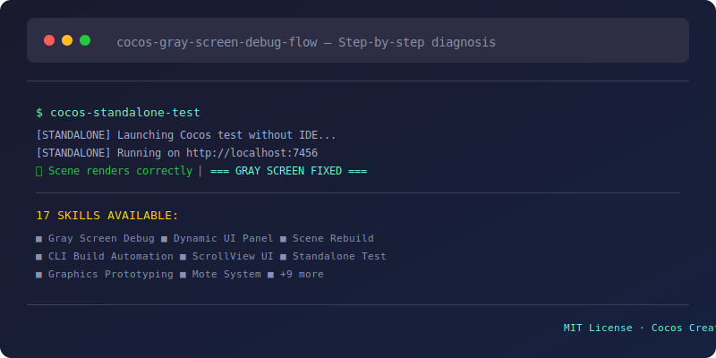
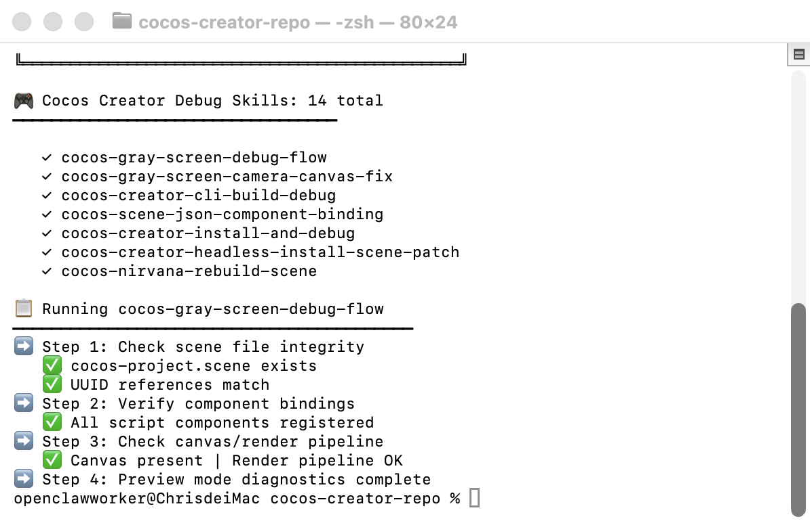

# Cocos Creator Debug Skills

<div align="center">

[](https://github.com/ChrisLamDev/cocos-creator-debug-skills/stargazers)
[](https://github.com/ChrisLamDev/cocos-creator-debug-skills/forks)
[](https://opensource.org/licenses/MIT)
[](skills/)
[](https://claude.ai)
[](https://openai.com)
[](https://cursor.sh)
[](https://github.com/NousResearch/hermes-agent)

</div>

**Your Cocos Creator 3.x keeps crashing with gray screens? Been there.**

## 📸 Demo

<div align="center">
  
  <br><br>
  
  <br>
  <em>Cocos Creator gray-screen-debug-flow terminal output — step-by-step scene file integrity, component bindings, and render pipeline diagnostics</em>
</div>

<br>


This collection of 17 executable AI agent skills documents every Cocos Creator 3.x bug I've encountered and the exact steps to fix them — gray screens, black previews, corrupt scene files, code-driven UI rendering issues, CLI build failures, and more.

Each skill is a proven workflow your AI agent can load and execute immediately.

## You've definitely been here:

```
- Gray/black screen on Play and you have no idea if it's the camera, canvas, or rendering pipeline
- Code-driven UI nodes render as gray boxes with no text
- ScrollView content never displays properly
- Scene file corrupts with Error 1222/1223 and you're about to redo everything
- CLI build fails but the error message tells you nothing useful
- Standalone test requires opening the full Cocos Creator IDE
```

## Highlight Skills

| Skill | One-liner |
|-------|-----------|
| **cocos-gray-screen-debug-flow** | Step-by-step gray/black screen diagnosis, from common to obscure |
| **cocos-dynamic-ui-panel** | Build full UI panels in pure TypeScript — no scene editor needed |
| **cocos-nirvana-rebuild-scene** | Recover from corrupt scene Error 1222/1223 |
| **cocos-creator-cli-build-debug** | Debug CLI build failures scene-by-scene |
| **cocos-code-driven-scrollview-ui** | Scrollable leaderboards and long lists in code |
| **cocos-graphics-mote-system** | Replace sprite particles with procedural graphics |
| **cocos-standalone-test** | Test Cocos code as standalone HTML — no IDE required |

## The 17 Skills

| # | Skill | Problem It Solves |
|---|-------|-------------------|
| 1 | **cocos-creator-install-and-debug** | New install scene import errors — version conflicts + plugin issues |
| 2 | **cocos-creator-cli-build-debug** | CLI build fails — scene/library/module errors one-by-one |
| 3 | **cocos-creator-headless-install-scene-patch** | Headless mode setup without GUI |
| 4 | **cocos-nirvana-rebuild-scene** | Corrupt scene Error 1222/1223 — full recovery flow |
| 5 | **cocos-gray-screen-debug-flow** | Gray/black screen — camera → canvas → rendering pipeline |
| 6 | **cocos-gray-screen-camera-canvas-fix** | Camera gray screen — config + canvas + render texture |
| 7 | **cocos-dynamic-ui-panel** | Full UI panels in pure TypeScript, no scene editor |
| 8 | **cocos-dynamic-ui-layer-color-font** | UI nodes as gray boxes with no text — AddChild timing + UIOpacity |
| 9 | **cocos-code-driven-scrollview-ui** | ScrollView content not displaying fully |
| 10 | **cocos-code-driven-ui-common-pitfalls** | Coordinate system + Anchor + parent-child timing |
| 11 | **cocos-scene-json-component-binding** | Component-scene binding failures |
| 12 | **cocos-graphics-visual-prototyping** | Zero-asset visual prototyping — Graphics component |
| 13 | **cocos-graphics-mote-system** | Replace sprite particles with procedural rendering |
| 14 | **cocos-standalone-test** | Test Cocos code as standalone HTML, no IDE |
| 15 | **cocos-ts-compile-check-sop** | TypeScript compile check — `tsc --noEmit` |
| 16 | **cocos-cli-build-automation-setup** | GUI-free build pipeline for CI/CD |
| 17 | **cocos-creator-scene-less-test-bootstrap** | Runtime test bootstrap without .scene files |

## Installation

```bash
# Hermes Agent
# Copy to your skills directory:
cp -r skills/* ~/.hermes/skills/

# Claude Code
cp -r skills/* ~/.claude/skills/

# Cursor
cp -r skills/* ~/.cursor/skills/
```

## Compatibility

- **Cocos Creator:** 3.x (tested on 3.6+)
- **AI Agents:** Hermes Agent, Claude Code, Cursor, any agent with skill-loading support
- **Platform:** macOS (some skills Windows-compatible)

## License

MIT — use freely, contribute back when you can.

---

> Built from real Cocos Creator debugging battles. Every skill here documents an actual bug we fixed.
